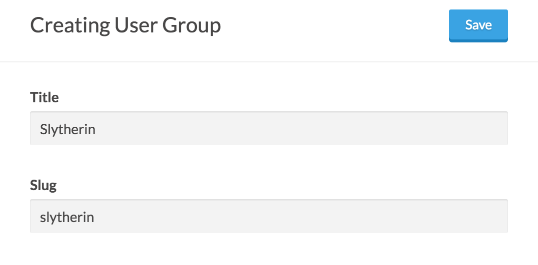
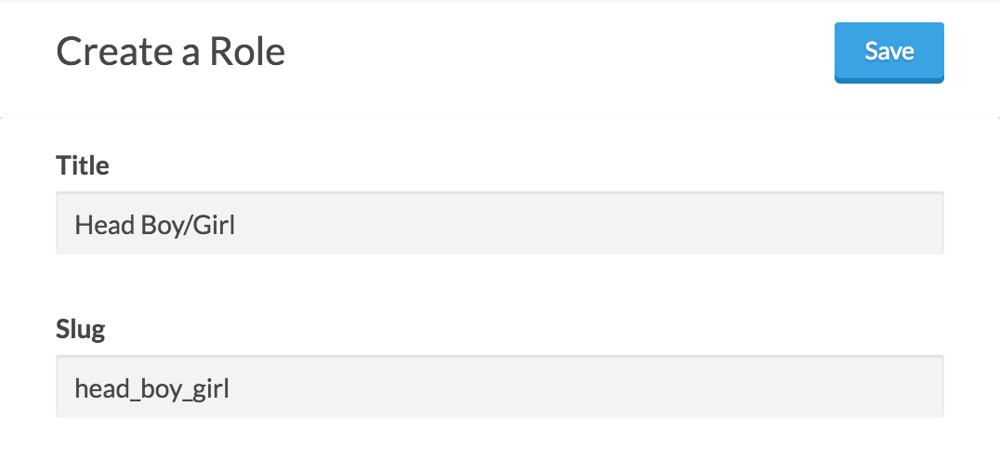
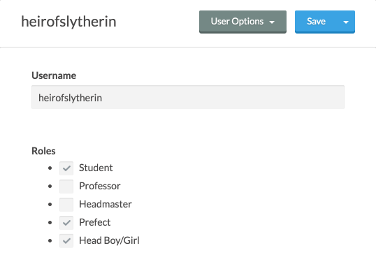

# Sorting Hat
Sorting Hat is a Statamic 2 addon that allows you to assign groups and roles to users at
registration by using the `{{ sorting_hat:field }}` Tag within a `{{ user:register_form }}`
Tag pair.

## Params
### `name`
Use `name` to set whether to assign a group or role with the generated input.

Valid values include `role` and `group` (plurals work, too).

### `value` / `values`
Pass in a slug or pipe-separated list of slugs corresponding to the group(s) or role(s) to assign to
the registering user.

## Example
  
*User Group*

  
*Role*


```html
{{ user:register_form }}
  {{# Place other fields here. #}}

  {{ sorting_hat:field
      name  = "roles"
      value = "student|prefect|head_boy_girl"
  }}
  {{ sorting_hat:field
      name  = "groups"
      value = "slytherin"
  }}

  <button>Register</button>
{{ /user:register_form }}
```

  
*User*
