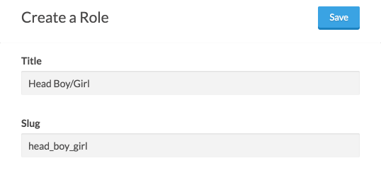

# Sorting Hat
Sorting Hat is a Statamic 2 addon that allows you to do more with groups and roles.

## Features
- Assign groups/roles to users upon registration.
- Loop through all groups and access their data.
- Access the data for a specified group.

## Tags
### `{{ sorting_hat:field }}`
Assign groups and roles to users at registration by using the `{{ sorting_hat:field }}` Tag within a
`{{ user:register_form }}` Tag pair.

#### Params
##### `name`
Use `name` to set whether to assign a group or role with the generated input.

Valid values include `role` and `group` (plurals work, too).

##### `value` / `values`
Pass in a slug or pipe-separated list of slugs corresponding to the group(s) or role(s) to assign to
the registering user.

#### Example
  
*User Group*

  
*Role*


```html
{{ user:register_form }}
  {{# Place other fields here. #}}

  {{ sorting_hat:field
      name  = "roles"
      value = "student|prefect|head_boy_girl"
  }}
  {{ sorting_hat:field
      name  = "groups"
      value = "slytherin"
  }}

  <button>Register</button>
{{ /user:register_form }}
```

  
*User*

### `{{ sorting_hat:user_groups }}`
Loop through all groups and access their data with the `{{ sorting_hat:user_groups }}` tag pair.

#### Params
##### `use_context`
Set to a truthy value to use the current context.

#### Vars
##### `{{ title }}`
The User Group's title.

##### `{{ slug }}`
The User Group's slug.

##### `{{ roles }}`
An array of the UUIDs for the roles assigned to the User Group.

##### `{{ users }}`
An array of the UUIDs for the users assigned to the User Group.

#### Example
```html
<ul>
  {{ sorting_hat:user_groups }}
    <li>
      {{ title }}
      <ul>
        <li>{{ slug }}</li>
        <li>{{ roles | ul }}</li>
        <li>{{ users | ul }}</li>
      </ul>
    </li>
  {{ /sorting_hat:user_groups }}
</ul>
```

### `{{ sorting_hat:user_group }}`
Use this in conditionals to check if a User Group exists or as a tag pair to get the data for the
specified User Group.

#### Params
**You must set `title` or `slug`.**

##### `title`
The title of the User Group to get data for.

##### `slug`
The title of the User Group to get data for.

##### `use_context`
Set to a truthy value to use the current context.

#### Examples
##### Conditional
```statamic
{{# If there's no User Group for this URL, redirect to homepage. #}}
{{ if !{sorting_hat:user_group slug="{last_segment | underscored}"} }}
  {{ redirect to="/" }}
{{ /if }}
```

##### Tag pair
```html
{{ sorting_hat:user_group slug="{last_segment | underscored}" }}
<ul>
  <li>
    {{ title }}
    <ul>
      <li>{{ slug }}</li>
      <li>{{ roles | ul }}</li>
      <li>{{ users | ul }}</li>
    </ul>
  </li>
</ul>
{{ /sorting_hat:user_group }}
```

---

[License](http://creativecommons.org/licenses/by-sa/4.0/)
